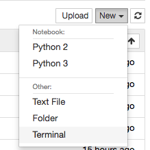
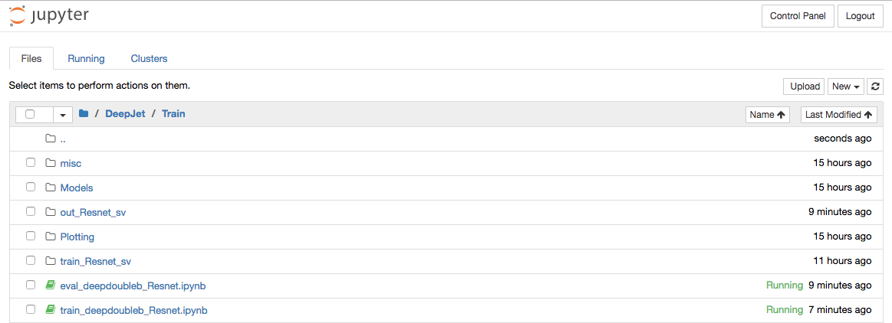

# Instructions for running on Caltech GPUs
 * Log onto https://imperium-sm.hep.caltech.edu and start your server
 * Start a new terminal by clicking on the top right
 


 * Clone our `DeepJet` repository as usual, but do not install `miniconda2`
 ```bash
 git clone https://github.com/DeepDoubleB/DeepJet
 ```
 * Go back to the directory tree (original tab) and navigate to the `DeepJet/Train` folder
 


 * To run a training, open and run the notebook `DeepJet/Train/train_deepdoubleb_Resnet.py`. You can evaluate each cell of the notebook by doing `shift`+`enter` once your cursor is in that cell.
 * To evalate the performance after the training, open the notebook `DeepJet/Train/train_deepdoubleb_Resnet.py` and execute each cell of the notebook (Note this training is not working correctly yet... but the plots are still made).
